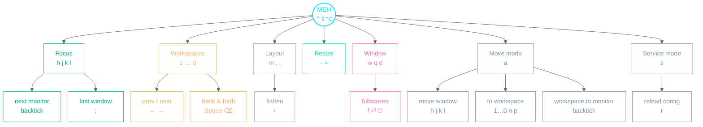

# AeroSpace Playbook

A personal, config-accurate cheat-sheet for macOS window management. Every
keybinding below is taken from this repo's actual config —
`config/aerospace/.aerospace.toml` — not AeroSpace defaults.
[AeroSpace](https://github.com/nikitabobko/AeroSpace) tiles windows across
workspaces; it is launched by `dotup-services` alongside skhd, borders and
sketchybar. The system-wide `HYPR` hotkeys live with skhd — see the
[Hotkeys Playbook](HOTKEYS.md).

- **The AeroSpace modifier is `MEH` = `⌃⇧⌥`** (Control + Shift + Option). So
  `MEH + h` means hold all three, then `h`.
- Three modes: **main** (always on), **move** (`MEH + a`), **service**
  (`MEH + s`). Sketchybar shows the active mode and workspace.

---

## Muscle-memory starter — the 8 to learn first

| Keys                               | Action                                   |
| ---------------------------------- | ---------------------------------------- |
| `MEH` + (`h` \| `j` \| `k` \| `l`) | Focus window left/down/up/right          |
| `MEH` + (`1` … `0`)                | Focus workspace by number                |
| `MEH + Space`                      | Toggle to the last-used workspace        |
| `MEH + a`, then `h j k l`          | Move the focused window                  |
| `MEH + a`, then `1` … `0`          | Send window to a workspace and follow it |
| `MEH + f`                          | Toggle fullscreen                        |
| `MEH + w`                          | Close the focused window                 |
| `MEH + m`                          | Toggle floating ↔ tiling for the window  |

---

## Keyspace at a glance

The whole `MEH` namespace, one level deep — the mental model behind the tables
below.

---

## Main mode

**Focus**

| Keys                  | Action                                                                            |
| --------------------- | --------------------------------------------------------------------------------- |
| `MEH + h` / `MEH + l` | Focus window left / right; at the workspace edge, wraps to the adjacent workspace |
| `MEH + j` / `MEH + k` | Focus window down / up (stops at monitor edges)                                   |
| `MEH + ;`             | Toggle to the last-focused window (back-and-forth)                                |
| `MEH + Backtick`      | Focus the next monitor (wrap-around)                                              |

**Workspaces**

| Keys                  | Action                                             |
| --------------------- | -------------------------------------------------- |
| `MEH` + (`1` … `0`)   | Focus workspace by number                          |
| `MEH + ←` / `MEH + →` | Focus previous / next workspace (wrap-around)      |
| `MEH + Space`         | Toggle to the last-used workspace (back-and-forth) |
| `MEH + Backspace`     | Same as `MEH + Space`                              |

**Windows**

| Keys          | Action                                |
| ------------- | ------------------------------------- |
| `MEH + w`     | Close the focused window              |
| `MEH + q`     | Close all windows but the current one |
| `MEH + d`     | Minimize the focused window (native)  |
| `MEH + f`     | Toggle AeroSpace fullscreen           |
| `MEH + Enter` | Toggle native macOS fullscreen        |
| `MEH + Esc`   | Exit native macOS fullscreen          |

**Layout & resize**

| Keys      | Action                                        |
| --------- | --------------------------------------------- |
| `MEH + m` | Toggle floating ↔ tiling layout               |
| `MEH + ,` | Toggle accordion layout (horizontal/vertical) |
| `MEH + .` | Toggle tiles layout (horizontal/vertical)     |
| `MEH + /` | Flatten the workspace tree                    |
| `MEH + -` | Shrink the focused window (smart resize −50)  |
| `MEH + =` | Grow the focused window (smart resize +50)    |

**Modes**

| Keys      | Action                 |
| --------- | ---------------------- |
| `MEH + a` | Enter **move** mode    |
| `MEH + s` | Enter **service** mode |

---

## Move mode (`MEH + a`, then)

Move mode is **one-shot**: every action drops you straight back to main mode,
so there's no need to press `Esc` after a move.

| Keys       | Action                                                                              |
| ---------- | ----------------------------------------------------------------------------------- |
| `h` / `l`  | Move window left / right; at the workspace edge, moves it to the adjacent workspace |
| `j` / `k`  | Move window down / up                                                               |
| `1` … `0`  | Move window to workspace by number and follow it                                    |
| `n` / `p`  | Move window to the next / previous workspace and follow it (wrap-around)            |
| `Backtick` | Move the current workspace to the next monitor (wrap-around)                        |
| `Esc`      | Return to main mode without moving anything                                         |

---

## Service mode (`MEH + s`, then)

| Keys  | Action                                        |
| ----- | --------------------------------------------- |
| `r`   | Reload the AeroSpace config (returns to main) |
| `Esc` | Return to main mode                           |

---

## Where each app lives

Apps are auto-assigned to workspaces on launch (`on-window-detected`), and
workspaces are pinned to monitors. Utility apps float instead of tiling.

| Workspace | Apps                   | Monitor              |
| --------- | ---------------------- | -------------------- |
| 1         | Arc                    | main                 |
| 2         | Alacritty, Fork        | main                 |
| 3         | VSCode                 | main                 |
| 4         | Claude                 | main                 |
| 5         | —                      | main                 |
| 6         | Slack                  | main                 |
| 7         | Hey                    | main                 |
| 8         | —                      | main                 |
| 9         | —                      | secondary, else main |
| 0         | Notion Calendar (Cron) | secondary, else main |

**Always floating**: System Settings, Little Snitch (agent, monitor, app),
1Password.

---

_Source of truth: `config/aerospace/.aerospace.toml` (plus the
`focus-or-workspace.sh` / `move-or-workspace.sh` helpers beside it). When you
change a binding there, update this file in the same commit._
