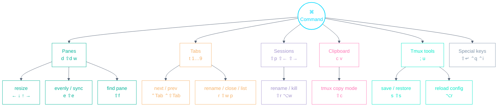

# Alacritty Playbook

A personal, config-accurate cheat-sheet for the terminal emulator. Every
keybinding below is taken from this repo's actual config —
`config/alacritty/.config/alacritty/keyboard.toml` — with Alacritty/macOS
defaults clearly marked _(default)_.
[Alacritty](https://github.com/alacritty/alacritty) launches
[tmux](TMUX.md) directly at startup (`terminal.toml` runs `zsh -l -i -c tmux`),
and almost every binding here is a `⌘` chord translated into a tmux prefix
sequence — native macOS muscle memory driving tmux.

- **`⌘` chords are tmux commands in disguise** — the tables show the `⌃b`
  sequence each one sends.
- Shell-line editing (the zsh vi-mode) is separate — see the
  [Zsh Vi-mode Playbook](ZSH.md).

---

## Muscle-memory starter — the 8 to learn first

| Keys              | Action                                |
| ----------------- | ------------------------------------- |
| `⌘d` / `⌘⇧d`      | Vertical / horizontal pane            |
| `⌘t`              | New tab                               |
| `⌃Tab` / `⌃⇧Tab`  | Next / previous tab                   |
| `⌘` + (`1` … `9`) | Switch to a tab by number             |
| `⌘w`              | Close the current pane                |
| `⌘c` / `⌘v`       | Copy / paste via the system clipboard |
| `⌘⇧c`             | Enter tmux copy mode                  |
| `⌘⇧p`             | Pick a session                        |

---

## Keyspace at a glance

The whole `⌘` namespace, one level deep — the mental model behind the tables
below.

---

## Panes

| Keys                             | Sends        | Action                           |
| -------------------------------- | ------------ | -------------------------------- |
| `⌘d`                             | `⌃b %`       | Vertical pane (keeps the cwd)    |
| `⌘⇧d`                            | `⌃b "`       | Horizontal pane (keeps the cwd)  |
| `⌘w`                             | `⌃b x`       | Close the pane — no confirmation |
| `⌘` + (`←` \| `↓` \| `↑` \| `→`) | `⌃b H/J/K/L` | Resize the pane                  |
| `⌘e`                             | `⌃b E`       | Spread panes out evenly          |
| `⌘⇧e`                            | `⌃b ⌃s`      | Toggle pane synchronisation      |
| `⌘⇧f`                            | `⌃b f`       | Search for a pane                |

Pane _focus_ is not a `⌘` chord: use `⌃` + (`h` \| `j` \| `k` \| `l`), which
moves across tmux panes and vim splits alike (see [TMUX.md](TMUX.md)).

---

## Tabs (tmux windows)

| Keys              | Sends           | Action                    |
| ----------------- | --------------- | ------------------------- |
| `⌘t`              | `⌃b c`          | New tab (keeps the cwd)   |
| `⌃Tab` / `⌃⇧Tab`  | `⌃b n` / `⌃b p` | Next / previous tab       |
| `⌘` + (`1` … `9`) | `⌃b 1…9`        | Switch to a tab by number |
| `⌘p`              | `⌃b w`          | Choose a tab from a tree  |
| `⌘r`              | `⌃b ,`          | Rename the tab            |
| `⌘⇧w`             | `⌃b &`          | Close the tab             |

---

## Sessions

| Keys          | Sends           | Action                             |
| ------------- | --------------- | ---------------------------------- |
| `⌘⇧p`         | `⌃b s`          | Choose a session from a tree       |
| `⌘⇧←` / `⌘⇧→` | `⌃b (` / `⌃b )` | Previous / next session            |
| `⌘⇧r`         | `⌃b $`          | Rename the session                 |
| `⌘⌥w`         | `⌃b Q`          | Kill the session — no confirmation |

---

## Clipboard

| Keys             | Sends          | Action                              |
| ---------------- | -------------- | ----------------------------------- |
| `⌘c`             | `Copy` action  | Copy the selection to the clipboard |
| `⌘v` _(default)_ | `Paste` action | Paste from the clipboard            |
| `⌘⇧c`            | `⌃b [`         | Enter tmux copy mode                |

The full clipboard flow across tmux/zsh/Alacritty is in
[CLIPBOARD.md](CLIPBOARD.md).

---

## Tmux tools

| Keys  | Sends   | Action                                   |
| ----- | ------- | ---------------------------------------- |
| `⌘;`  | `⌃b :`  | Open the tmux command prompt             |
| `⌘u`  | `⌃b u`  | Grab and open a URL (tmux-urlview)       |
| `⌘s`  | `⌃b S`  | Save the environment (tmux-resurrect)    |
| `⌘⇧s` | `⌃b R`  | Restore the environment (tmux-resurrect) |
| `⌘⌥r` | `⌃b ⌃r` | Reload the tmux config                   |

---

## Special keys

Three bindings fix terminal key-encoding quirks rather than drive tmux:

| Keys      | Sends     | Why                                                                                                   |
| --------- | --------- | ----------------------------------------------------------------------------------------------------- |
| `⇧Return` | `⎋` + `↵` | Insert a newline without submitting (REPLs, Claude Code, etc.)                                        |
| `⌃q`      | raw `⌃q`  | macOS swallows `⌃q` by default ([alacritty#1359](https://github.com/alacritty/alacritty/issues/1359)) |
| `⌃i`      | `⌃n i`    | Lets vim tell `⌃i` apart from `Tab` (vim maps `⌃n i` back to `⌃i`)                                    |

---

_Source of truth: `config/alacritty/.config/alacritty/keyboard.toml` (and
`terminal.toml` for the tmux launch). When you change a binding there, update
this file in the same commit._
