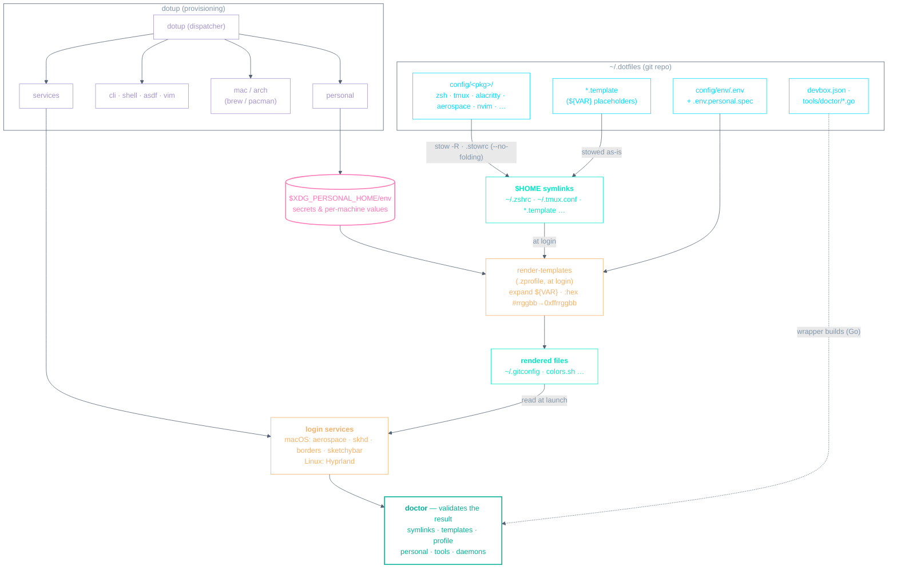
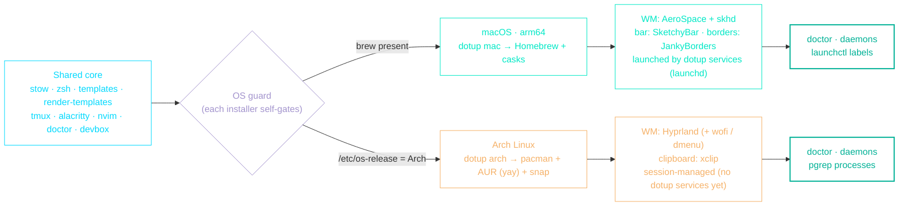

# Architecture

How this repo becomes a configured machine — and how it stays honest.

## Walkthrough

**Repo → `$HOME`.** GNU Stow, driven by `.stowrc`
(`--dir=./config --target=~ --no-folding`), symlinks each `config/<pkg>/`
package into `$HOME`. With `--no-folding`, real directories are created and
individual files are linked, so one real `~/.config/` can hold links from many
packages at once.

**Templates.** Config needing per-machine or secret values lives as `*.template`
files with `${VAR}` placeholders. They are stowed into `$HOME` like any other
file, then [`render-templates`](../config/bin/.local/bin/render-templates) —
invoked from `.zprofile` at login — expands them in place
(`~/.gitconfig.template` → `~/.gitconfig`) using `config/env/.env` plus your
out-of-repo personal values at `$XDG_PERSONAL_HOME/env` (managed by
`dotup personal`). Entries tagged `:hex` also convert `#rrggbb` →
`0xffrrggbb` for tools that need it (sketchybar, borders).

**Provisioning.** A single `dotup` dispatcher fans out to subcommands:
`personal` (writes the personal store), OS-split installers `mac`/`arch`
(Homebrew / pacman), the toolchain installers `cli`/`shell`/`asdf`/`vim`, and
`services`, which launches **aerospace · skhd · borders · sketchybar** on macOS
(Hyprland on Linux). Window management is AeroSpace; the `yabai` package is
legacy and is not started.

**Validation.** `dotup doctor` closes the loop, validating what provisioning
produced — `symlinks`, rendered `templates`, and running `daemons` — plus
`personal`, `tools`, and `profile`. The binary is built on demand from
`tools/doctor/*.go` by a wrapper (cached per machine), with Go pinned by devbox.

Two details left off the diagram for legibility:

- The `personal` check live-validates credentials (GitHub tokens via `gh api
user`, the 1Password token via `op`); a network failure degrades to
  `unverified` rather than failing.
- There are two doctor entrypoints — `dotup doctor` (cached binary, system Go)
  for day-to-day use, and `devbox run doctor` (`go run`, pinned Go) for repo
  dev / CI.

## Cross-platform (macOS / Linux)

A single `dotup` run executes every subcommand on both OSes; the OS-specific
installers **self-gate** — `dotup-mac` exits unless `brew` exists, `dotup-arch`
exits unless `/etc/os-release` says Arch — so the wrong-OS one is a no-op. The
shared core (stow, zsh, templates, tmux, alacritty, nvim, doctor, devbox) is
identical everywhere; only the platform backends differ.

| Capability      | macOS (arm64)                                  | Linux (Arch)                             |
| --------------- | ---------------------------------------------- | ---------------------------------------- |
| Provisioning    | `dotup mac` — Homebrew formulae + casks        | `dotup arch` — pacman + yay (AUR) + snap |
| Window manager  | AeroSpace + skhd                               | Hyprland                                 |
| Status bar      | SketchyBar                                     | — (none yet)                             |
| Window borders  | JankyBorders (`borders`)                       | Hyprland native                          |
| App launcher    | Alfred                                         | wofi / dmenu                             |
| Service launch  | `dotup services` → launchd (brew services)     | Hyprland session (no dotup hook yet)     |
| `daemons` check | `launchctl` labels (skhd, sketchybar, borders) | `pgrep` (Hyprland)                       |
| Clipboard       | `pbcopy` / `pbpaste`                           | `xclip`                                  |
| Secrets / 2FA   | 1Password CLI + pinentry-mac                   | 1Password CLI + pam-u2f / libfido2       |

**Maturity:** macOS is the primary, fully wired setup; the Arch/Hyprland machine
is supported but minimal and still growing (the `daemons` check only watches
`Hyprland`). Two known parity gaps to close as Linux matures:

- `dotup services` only starts the macOS daemons; there is no Linux equivalent
  (e.g. `systemd --user` units) yet.
- The zsh vi-mode clipboard mirroring in `config/zsh/.config/zsh/bindings.zsh`
  hardcodes `pbcopy`/`pbpaste` (macOS-only); tmux copy/paste is already portable
  via tmux-yank. A portable `clip` helper would close this.

For keybindings see the per-tool playbooks — [NEOVIM.md](NEOVIM.md),
[AEROSPACE.md](AEROSPACE.md), [SKHD.md](SKHD.md), [TMUX.md](TMUX.md),
[ALACRITTY.md](ALACRITTY.md), [ZSH.md](ZSH.md) and [BROWSER.md](BROWSER.md) —
and [CLIPBOARD.md](CLIPBOARD.md) for the clipboard flow.
