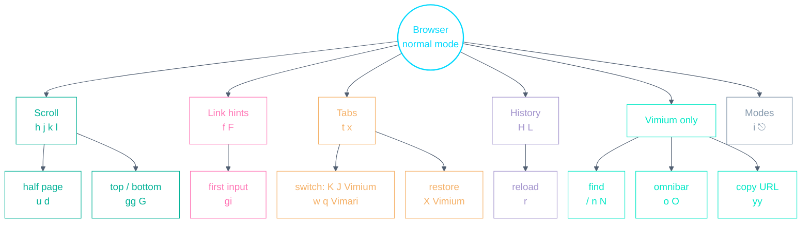

# Browser Playbook (Vimium / Vimari)

A personal, config-accurate cheat-sheet for vim-style browsing.
[Vimium](https://github.com/philc/vimium) runs in Chromium/Firefox browsers;
[Vimari](https://github.com/televator-apps/vimari) is its smaller Safari
cousin. **No keys are remapped** — the `keyMappings` block in
`config/vimium/.config/vimium/vimium-options.json` is empty, so every binding
below is an extension default. What _is_ customised is Vimium's behavior
(excluded sites, hint characters, search — see
[Vimium behavior tweaks](#vimium-behavior-tweaks)). Vimari has no config in
this repo; it's configured inside Safari and follows its own defaults.

- **The core keys are shared** — scroll, hints, history and tabs feel the same
  in both browsers.
- **Tab switching is the one habit that differs**: `K`/`J` in Vimium,
  `w`/`q` in Vimari.
- `?` in Vimium shows the full built-in cheat sheet.

---

## Muscle-memory starter — the 8 to learn first

| Keys                                | Action                                 |
| ----------------------------------- | -------------------------------------- |
| `f` / `F`                           | Link hints — open here / in a new tab  |
| `j` / `k`                           | Scroll down / up                       |
| `d` / `u`                           | Half page down / up                    |
| `gg` / `G`                          | Top / bottom of the page               |
| `H` / `L`                           | History back / forward                 |
| `K` `J` (Vimium) · `w` `q` (Vimari) | Next / previous tab                    |
| `t` / `x`                           | New tab / close tab                    |
| `/` then `n`                        | Find on page, next match (Vimium only) |

---

## Keyspace at a glance

---

## Shared keys (Vimium & Vimari)

| Keys         | Action                                    |
| ------------ | ----------------------------------------- |
| `f` / `F`    | Link hints — open in this tab / a new tab |
| `h` / `l`    | Scroll left / right                       |
| `j` / `k`    | Scroll down / up                          |
| `d` / `u`    | Scroll half a page down / up              |
| `gg` / `G`   | Go to the top / bottom of the page        |
| `gi`         | Focus the first input on the page         |
| `H` / `L`    | Go back / forward in history              |
| `r`          | Reload the page                           |
| `t`          | New tab                                   |
| `x`          | Close the current tab                     |
| `i`          | Insert mode (pass keys to the page)       |
| `Esc` / `⌃[` | Back to normal mode                       |

## Tab switching — the one difference

| Browser | Next tab | Previous tab |
| ------- | -------- | ------------ |
| Vimium  | `K`      | `J`          |
| Vimari  | `w`      | `q`          |

## Vimium only

| Keys      | Action                                              |
| --------- | --------------------------------------------------- |
| `X`       | Restore the last closed tab                         |
| `yy`      | Copy the current URL to the clipboard               |
| `o` / `O` | Omnibar: open URL/bookmark/history — here / new tab |
| `/`       | Find on the page (`n` / `N` next / previous match)  |
| `gf`      | Cycle focus to the next frame                       |
| `gs`      | View page source                                    |
| `?`       | Show Vimium's built-in cheat sheet                  |

Vimari can't do these (Safari API limits); for the address bar use Safari's
native `⌘L`.

---

## Vimium behavior tweaks

The stowed `vimium-options.json` customises behavior, not keys:

- **Vimium is disabled on**: `localhost`, Excalidraw, Miro, Gmail, Hey,
  Codewars and hackertyper — sites with their own keybindings.
- **Link hints** use home-row-ish characters (`sadfjklewcmpgh`).
- **Smooth scrolling** on, with a 60px scroll step.
- **`w:` search shortcut** in the omnibar searches Wikipedia; the default
  engine is Google.

> The options file is a manual export/import: after changing settings in the
> extension, export them back into
> `config/vimium/.config/vimium/vimium-options.json`.

---

_Source of truth: `config/vimium/.config/vimium/vimium-options.json` for
Vimium's behavior (keys are extension defaults, verified against the Vimium
and Vimari READMEs). Vimari is configured in Safari itself — no repo config.
When either setup changes, update this file in the same commit._
