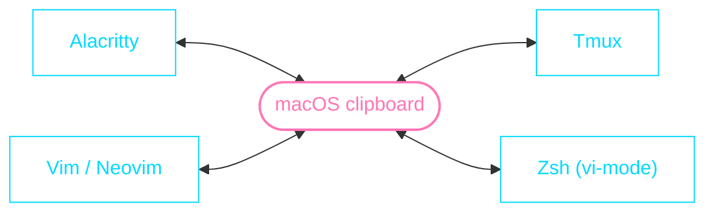

# Clipboard (Copy / Paste)

Copying from any layer writes to the single **macOS clipboard** (the system
pasteboard), and the main paste commands — `⌘v`, and `p` in Vim/zsh — read it
back, so a copy in one layer is available in all the others; the two exceptions
are Alacritty middle-click and tmux `⌃b + ]`, which read their own local buffers
(the selection buffer / tmux's paste buffer) that are filled on copy too, so they
usually match the system clipboard but can drift.

## Copy

| Context                        | Action                                    | Copies via              |
| ------------------------------ | ----------------------------------------- | ----------------------- |
| Alacritty — mouse              | Drag to select (auto-copies)              | `save_to_clipboard`     |
| Alacritty — mouse, inside tmux | `⇧` + drag (bypasses tmux)                | `save_to_clipboard`     |
| Alacritty — keyboard           | Select, then `⌘c`                         | Alacritty `Copy` action |
| tmux copy mode                 | `v` select → `y` or `Enter`               | tmux-yank → `pbcopy`    |
| tmux copy mode — block         | `⌃v` rectangle → `y`                      | tmux-yank → `pbcopy`    |
| tmux — mouse                   | Drag in a pane (copies on release)        | tmux-yank               |
| tmux — mouse                   | Double-click = word · Triple-click = line | tmux-yank               |
| Vim                            | `yy` · `y{motion}` · visual `y`           | `clipboard=unnamedplus` |
| Shell (zsh vi-mode)            | Normal mode: `yy`, `dd`, `x`, `cw`, …     | `pbcopy` wrappers       |

## Paste

| Context             | Action                 | Source               |
| ------------------- | ---------------------- | -------------------- |
| Alacritty / shell   | `⌘v`                   | macOS clipboard      |
| Alacritty — mouse   | Middle-click           | last mouse selection |
| tmux                | `⌃b + ]`               | tmux's own buffer    |
| Vim                 | `p` / `P`              | macOS clipboard      |
| Shell (zsh vi-mode) | Normal mode: `p` / `P` | macOS clipboard      |

## Selection / copy mode

Two layers have a keyboard selection mode you must _enter_ first; the mouse is
modeless.

| Layer                        | Enter the mode    | Select       | Copy          |
| ---------------------------- | ----------------- | ------------ | ------------- |
| Alacritty (mouse)            | modeless          | drag         | auto / `⌘c`   |
| Alacritty (keyboard vi-mode) | `⌃⇧Space`         | `v` + motion | `y`           |
| tmux copy mode               | `⌘⇧c` or `⌃b + [` | `v` + motion | `y` / `Enter` |

> Inside tmux, prefer **tmux copy mode** for keyboard selection — it understands
> panes and tmux scrollback. Alacritty's vi-mode only sees the rendered screen
> and is mainly useful when you're _not_ in tmux.
