# Neovim Playbook

A personal, config-accurate cheat-sheet for everyday editing. Every keybinding
below is taken from this repo's actual config under
`config/neovim/.config/nvim/` — not generic Vim defaults. Where a task has **no
custom binding**, the row is marked _(default)_ and gives the plugin/Vim default.

- **Leader = `,`** (comma). So `,gs` means press comma then `g` then `s`.
- **Local leader = `\`** (backslash).
- Hit **`<C-X>`** (Ctrl-X) any time to pop up **which-key** and browse what's bound.
- `timeoutlen` is 500ms — chords don't wait long; type them briskly.

---

## Muscle-memory starter — the 15 to learn first

| Keys                            | Action                                 |
| ------------------------------- | -------------------------------------- |
| `<C-P>`                         | Find file in repo (git files, fzf-lua) |
| `<C-G>`                         | Switch buffer (fzf-lua)                |
| `<C-F>`                         | Find & replace across project (CtrlSF) |
| `` ` ``                         | Jump into the file tree (nvim-tree)    |
| `<C-H>`/`<C-J>`/`<C-K>`/`<C-L>` | Move between splits **and** tmux panes |
| `gd`                            | Go to definition                       |
| `gr`                            | Find references                        |
| `K`                             | Hover docs                             |
| `,la`                           | Code action (fix/refactor)             |
| `,rn`                           | Rename symbol (live preview)           |
| `,/`                            | Toggle comment (works in visual too)   |
| `,gp`                           | Preview git hunk                       |
| `,gs`                           | Stage git hunk                         |
| `<C-S>`                         | Save                                   |
| `,<Space>`                      | Clear search highlight                 |

---

## Keyspace at a glance

The whole leader (`,`) namespace, one level deep — the mental model behind the
tables below.

```mermaid
%%{init: {'flowchart': {'nodeSpacing': 18, 'rankSpacing': 45}}}%%
flowchart TD
    leader(("Leader<br/>,")):::core

    leader --> git["Git<br/>,g"]:::git
    git --> git1["hunks<br/>gs gr gp"]:::git
    git --> git2["blame<br/>gb"]:::git
    git --> git3["Diffview<br/>,gd"]:::git
    git --> git4["permalink<br/>,gl"]:::git
    git --> git5["toggles<br/>,gt"]:::git
    git --> git6["lazygit<br/>,gg"]:::git

    leader --> find["Find & Replace<br/>,f"]:::find
    leader --> lsp["LSP<br/>,l"]:::lsp
    lsp --> lsp1["code action<br/>la"]:::lsp
    lsp --> lsp2["format<br/>lf"]:::lsp
    lsp --> lsp3["highlight<br/>,lh"]:::lsp
    leader --> trouble["Trouble<br/>,e"]:::trouble
    leader --> todo["TODO<br/>,t"]:::todo
    leader --> buffer["Buffer<br/>,b"]:::buffer
    leader --> notif["Notifications<br/>,u"]:::buffer
    leader --> gpt["GPT<br/>,x"]:::ai
    leader --> copilot["Copilot<br/>,p"]:::ai
    leader --> claude["Claude Code<br/>,a"]:::ai

    %% Colors from config/env/.env palette (see docs/ARCHITECTURE.md):
    %% core=#02d9fe  git=#00b196  find=#f5b168  lsp=#a394cd
    %% trouble=#ff75b5  todo=#00e8c6  ai=#8296aa  links=#515f72
    classDef core fill:transparent,stroke:#02d9fe,stroke-width:2px,color:#02d9fe
    classDef git fill:transparent,stroke:#00b196,color:#00b196
    classDef find fill:transparent,stroke:#f5b168,color:#f5b168
    classDef lsp fill:transparent,stroke:#a394cd,color:#a394cd
    classDef trouble fill:transparent,stroke:#ff75b5,color:#ff75b5
    classDef todo fill:transparent,stroke:#00e8c6,color:#00e8c6
    classDef buffer fill:transparent,stroke:#02d9fe,color:#02d9fe
    classDef ai fill:transparent,stroke:#8296aa,color:#8296aa
    linkStyle default stroke:#515f72,color:#8296aa
```

## Which tool for which job

Several plugins overlap. When you're unsure which to reach for — finders in cyan,
search in orange, git tools in green:

```mermaid
%%{init: {'flowchart': {'nodeSpacing': 18, 'rankSpacing': 45}}}%%
flowchart TD
    A["Open a file by name"]:::intent --> B["&lt;C-P&gt;<br/>fzf-lua git_files"]:::find
    C["Jump to an open buffer"]:::intent --> D["&lt;C-G&gt;<br/>fzf-lua buffers"]:::find
    E["Browse all pickers"]:::intent --> F[",&lt;C-O&gt;<br/>Telescope"]:::find
    G["Search / replace in repo"]:::intent --> H["&lt;C-F&gt;<br/>CtrlSF"]:::search
    I["Stage / preview a hunk"]:::intent --> J[",g*<br/>gitsigns"]:::git
    K["Full status / commit TUI"]:::intent --> L[",&lt;C-G&gt;<br/>Neogit"]:::git
    Q["Floating git TUI"]:::intent --> R[",gg<br/>lazygit (snacks)"]:::git
    M["Side-by-side diff or history"]:::intent --> N[",gd*<br/>Diffview"]:::git
    O["Copy / open a permalink"]:::intent --> P[",gl*<br/>gitlinker"]:::git

    %% Colors from config/env/.env palette (see docs/ARCHITECTURE.md):
    %% intent=#8296aa  find=#02d9fe  search=#f5b168  git=#00b196  links=#515f72
    classDef intent fill:transparent,stroke:#8296aa,color:#8296aa
    classDef find fill:transparent,stroke:#02d9fe,color:#02d9fe
    classDef search fill:transparent,stroke:#f5b168,color:#f5b168
    classDef git fill:transparent,stroke:#00b196,color:#00b196
    linkStyle default stroke:#515f72,color:#8296aa
```

---

## File explorer

Primary tree is **nvim-tree**. Only the focus key is custom; everything _inside_
the tree uses nvim-tree's own default keymaps (press **`g?`** in the tree for the
full list — these are plugin defaults, not configured here).

| Keys                                        | Action                              | When                                        |
| ------------------------------------------- | ----------------------------------- | ------------------------------------------- |
| `` ` `` (backtick)                          | Focus nvim-tree (`:NvimTreeFocus`)  | Jump to the tree without losing your buffer |
| `:NvimTreeToggle` _(default cmd, no key)_   | Open/close the tree                 | Show/hide the sidebar                       |
| `:NvimTreeFindFile` _(default cmd, no key)_ | Reveal current file in tree         | "Where am I in the project?"                |
| `-`                                         | nnn file **picker** at buffer's dir | Quick one-shot file pick                    |
| `~`                                         | nnn **explorer** at buffer's dir    | Browse with nnn instead of the tree         |
| `,bh`                                       | Startify home screen                | MRU / git-modified / bookmarks landing page |

**Inside the nvim-tree window (nvim-tree defaults):**

| Keys                        | Action                               |
| --------------------------- | ------------------------------------ |
| `<CR>` / `o`                | Open file / expand folder            |
| `a`                         | Create file (end with `/` for a dir) |
| `r`                         | Rename                               |
| `d`                         | Delete                               |
| `x` / `c` / `p`             | Cut / copy / paste                   |
| `<C-v>` / `<C-x>` / `<C-t>` | Open in vsplit / split / new tab     |
| `R`                         | Refresh tree                         |
| `H`                         | Toggle hidden (dotfiles)             |
| `-`                         | Step up to parent dir                |
| `q`                         | Close tree                           |
| `g?`                        | Help / all mappings                  |

---

## Fuzzy finding

Backed by **fzf-lua** (and Telescope for a few menus). `<C-P>` is rebound from
CtrlP to fzf-lua; CtrlP is still installed and reachable via `:CtrlP`.

| Keys                                       | Action                                       | When                                                       |
| ------------------------------------------ | -------------------------------------------- | ---------------------------------------------------------- |
| `<C-P>`                                    | Git-tracked files (`FzfLua git_files`)       | Default file finder — fast, respects `.gitignore`          |
| `<C-G>`                                    | Open buffers (`FzfLua buffers`)              | Jump to an already-open file                               |
| `,sb`                                      | Buffers via Telescope                        | Same, Telescope UI                                         |
| `,<C-O>`                                   | Telescope command palette (`:Telescope`)     | Browse every Telescope picker (find_files, oldfiles, etc.) |
| `,gc`                                      | Buffer's git commits (`FzfLua git_bcommits`) | History of the current file as a picker                    |
| `:FzfLua oldfiles` _(default cmd, no key)_ | Recent files                                 | Reopen something from a past session                       |
| `:FzfLua resume` _(default cmd, no key)_   | Resume last fzf-lua search                   | Reopen the picker exactly where you left it                |
| `:CtrlP` _(default cmd, no key)_           | CtrlP finder                                 | Fallback finder                                            |

> Note: there's no custom key for recent-files or resume — use the `:FzfLua`
> commands above, or `,<C-O>` → `oldfiles` through Telescope.

**Inside a picker** _(fzf-lua / fzf.vim defaults)_: `<C-T>` open in a new tab,
`<C-V>` vertical split, horizontal split with `<C-S>` (fzf-lua) or `<C-X>`
(fzf.vim).

**Inside the CtrlP prompt** _(plugin defaults — full list: `:help
ctrlp-mappings`)_: `<C-J>`/`<C-K>` move through results, `<C-F>`/`<C-B>` cycle
files ↔ buffers ↔ MRU modes, `<C-D>` filename-only match, `<C-R>` regexp mode,
`<C-T>`/`<C-X>`/`<C-V>` open in tab/split/vsplit, `<C-Y>` create the typed file
(and parent dirs), `<C-Z>` mark several files then `<C-O>` open them all.

---

## Search across the repo

**CtrlSF** is the workhorse: live grep into a results pane you can edit in place
(find-and-replace across files). `greplace` is the secondary quickfix-style path.

| Keys                                             | Action                                           | When                                                      |
| ------------------------------------------------ | ------------------------------------------------ | --------------------------------------------------------- |
| `<C-F>`                                          | Prompt CtrlSF search (`:CtrlSF -hidden …`)       | Start a project-wide search; leaves cursor on the pattern |
| `,fp`                                            | Prompt CtrlSF search                             | Same as `<C-F>`                                           |
| `,fw`                                            | Search **word under cursor** (`CtrlSFCwordPath`) | "Find every use of this identifier"                       |
| `,fx`                                            | Word under cursor, **whole-word** boundary       | Exact-token search, no substrings                         |
| `,fl`                                            | Prompt with the **last** search pattern          | Re-run or refine the previous search                      |
| `,fo`                                            | Open CtrlSF results pane                         | Reopen results without re-searching                       |
| `,ft`                                            | Toggle results pane                              | Show/hide matches                                         |
| `,ff`                                            | Focus the results pane                           | Jump into matches to edit them                            |
| `,fu`                                            | Update results                                   | Re-run after edits                                        |
| `,fs`                                            | Stop the running search                          | Halt a long search mid-flight                             |
| `,fc`                                            | Close pane                                       | Done searching                                            |
| `,f<Space>`                                      | Clear CtrlSF highlights                          | Tidy up                                                   |
| `,fe` _(visual)_                                 | Search the selected text                         | Grep the exact selection                                  |
| `,fv` _(visual)_                                 | Prompt with selection prefilled                  | Selection as starting pattern                             |
| `:Gsearch` / `:Greplace` _(default cmd, no key)_ | greplace via `ag` → quickfix → replace           | Alternative bulk replace through the quickfix list        |

**Editing inside the CtrlSF pane**: change matched lines directly, then `,fu`
(or `:w` in the pane) to write changes back to the real files.

**Inside the results pane (CtrlSF defaults):**

| Keys              | Action                                                        |
| ----------------- | ------------------------------------------------------------- |
| `<CR>` / `o`      | Open the match in the window CtrlSF was launched from         |
| `<C-O>`           | Open in a horizontal split                                    |
| `t` / `T`         | Open in a new tab (`T` keeps focus on the results pane)       |
| `p` / `P`         | Open in a preview window (`P` also focuses it; `q` closes it) |
| `O`               | Open the match but keep the results pane visible              |
| `<C-J>` / `<C-K>` | Next / previous match                                         |
| `<C-N>` / `<C-P>` | Next / previous file's first match                            |
| `M`               | Toggle normal ↔ compact view                                  |
| `<C-T>`           | fzf through the matches (`<CR>` focus, `<C-O>` open)          |
| `<C-C>`           | Stop a running search                                         |
| `q`               | Quit the pane                                                 |

---

## Git

Several tools, each for a different job: **gitsigns** (hunks/blame inline),
**fugitive** (`:G…` status/commands), **neogit** (full TUI), **lazygit**
(floating TUI via snacks), **diffview** (side-by-side + history), **gitlinker**
(permalinks).

| Keys                           | Action                            | When                                        |
| ------------------------------ | --------------------------------- | ------------------------------------------- |
| `,gg`                          | Open **Lazygit** (snacks float)   | Full git TUI in a floating window           |
| `,gL`                          | Lazygit repo log                  | Browse the commit history in lazygit        |
| `,gf`                          | Lazygit log for current file      | This file's history in lazygit              |
| `,<C-G>`                       | Open **Neogit**                   | Full status/stage/commit TUI                |
| `:G` _(fugitive, default cmd)_ | Fugitive status                   | Tim Pope-style staging/commands             |
| `,gs`                          | Stage hunk                        | Stage just the change under cursor          |
| `,gr`                          | Reset hunk                        | Discard the hunk under cursor               |
| `,gu`                          | Unstage hunk                      | Undo a stage                                |
| `,gS`                          | Stage whole buffer                | Stage the entire file                       |
| `,gR`                          | Reset whole buffer                | Discard all file changes                    |
| `,gp`                          | Preview hunk                      | Peek the diff inline before acting          |
| `,gv`                          | Select hunk (visual)              | Operate on the hunk as a text selection     |
| `,gb`                          | Blame current line                | "Who/when changed this line?"               |
| `,gtb`                         | Toggle inline line-blame          | Persistent blame virtual text on every line |
| `[h` / `]h`                    | Previous / next hunk              | Walk through changes in the buffer          |
| `,gq`                          | Hunks → quickfix (buffer)         | Collect this file's changes into quickfix   |
| `,gc`                          | Buffer's commit history (fzf-lua) | Browse past commits touching this file      |

**Fugitive status window** (`:G`, plugin defaults)

| Keys             | Action                                                      |
| ---------------- | ----------------------------------------------------------- |
| `s` / `u`        | Stage / unstage the file or hunk under cursor               |
| `-`              | Toggle stage/unstage (also on a visual selection)           |
| `U`              | Unstage everything                                          |
| `X`              | Discard the change under cursor                             |
| `P` / `I`        | Interactively add / reset patches for the file under cursor |
| `=`              | Toggle an inline diff of the file under cursor              |
| `cc`             | Open the commit window                                      |
| `o` / `gO` / `O` | Open in split / vsplit / tab                                |
| `p`              | Open in a preview window                                    |
| `(` / `)`        | Jump to previous / next file, hunk or revision              |
| `[c` / `]c`      | Previous / next hunk, expanding inline diffs                |

Fugitive commands from any buffer: `:G <cmd>` runs any git command (`:G blame`,
`:G add .`), `:Gwrite` stages the file, `:Gread` checks it out, `:Gdiffsplit`
diffs against the index (`:diffput`/`:diffget` per hunk), `:GMove`/`:GRename`
rename, `:GDelete`/`:GRemove` remove, `:GBrowse` opens it on GitHub.

**Diffview & history**

| Keys   | Action                                   | When                                       |
| ------ | ---------------------------------------- | ------------------------------------------ |
| `,gdo` | Open diffview                            | Side-by-side diff of working tree          |
| `,gdc` | Close diffview                           | Done                                       |
| `,gdh` | File history (`:DiffviewFileHistory`)    | Walk a file's full commit history visually |
| `,gdf` | Toggle the file panel                    | Show/hide the changed-files list           |
| `,gdr` | Refresh diffview                         | Re-read after external changes             |
| `,gdt` | Diff **this** file (`Gitsigns diffthis`) | Quick single-file diff against index       |

**Conflicts**: open the conflicted files with `,gdo` (Diffview shows ours/theirs/
base). Resolve hunks in the merge view, or use fugitive's `:Gdiffsplit!` and the
`:diffget //2` (ours) / `:diffget //3` (theirs) defaults.

**Permalinks (gitlinker)**

| Keys                                | Action                    | When                                                  |
| ----------------------------------- | ------------------------- | ----------------------------------------------------- |
| `,glc`                              | Copy code permalink       | Share a line/range link (works on a visual range too) |
| `,glo`                              | Open permalink in browser | Jump to the line on the remote                        |
| `:GBrowse` _(rhubarb, default cmd)_ | Open file/range on GitHub | Fugitive-native browse                                |

**Toggles** (under `,gt`): `,gtd` deleted, `,gtl` line-hl, `,gtn` num-hl,
`,gts` signs, `,gtw` word-diff.

---

## Buffers, windows, tabs

Splits and tmux panes share `<C-H/J/K/L>` via **vim-tmux-navigator** — one set of
keys moves seamlessly across both.

**Buffers**

| Keys            | Action                   | When                               |
| --------------- | ------------------------ | ---------------------------------- |
| `<C-G>`         | Buffer picker (fzf-lua)  | Fuzzy-jump to an open buffer       |
| `[b` / `]b`     | Previous / next buffer   | Step through buffers               |
| `,bn` / `,bp`   | Next / previous buffer   | Same, leader-style                 |
| `,ba`           | Alternate buffer (`:b#`) | Toggle between the two most recent |
| `,bf` / `,bl`   | First / last buffer      | Jump to ends of the list           |
| `,bc`           | Close buffer (`:bd`)     | Drop the current buffer            |
| `,bs` / `<C-S>` | Save (`:update`)         | Write if modified                  |
| `,bh`           | Startify home            | Landing screen                     |

**Windows / splits**

| Keys                                         | Action                                           | When                                              |
| -------------------------------------------- | ------------------------------------------------ | ------------------------------------------------- |
| `<C-H>`/`<C-J>`/`<C-K>`/`<C-L>`              | Move left/down/up/right (split **or** tmux pane) | Universal pane navigation                         |
| `<C-\>`                                      | Go to recent window                              | Bounce back to last split                         |
| `<Tab>` / `<S-Tab>`                          | Cycle windows forward / backward                 | Rotate through splits                             |
| `<C-W>`                                      | Window command prefix                            | Native `<C-W>` operations (`s`, `v`, `q`, …)      |
| `<C-Left>`/`<C-Right>`                       | Resize width − / +                               | Widen/narrow a split                              |
| `<C-Down>`/`<C-Up>`                          | Resize height − / +                              | Shrink/grow a split                               |
| `:split` / `:vsplit` _(default cmd, no key)_ | Make a split                                     | New horizontal/vertical split (opens below/right) |

**Tabs**

| Keys                              | Action              | When                  |
| --------------------------------- | ------------------- | --------------------- |
| `[t` / `]t`                       | Previous / next tab | Step through tabs     |
| `:tabnew` _(default cmd, no key)_ | New tab             | Open a fresh tab page |

`<C-Q>` quits the window; `,q` quit; `,Q` / `,bQ` quit all.

---

## LSP / code intelligence

Native LSP via **nvim-lspconfig** + **mason**; diagnostics list via **trouble**;
formatting via **conform**.

| Keys            | Action                                  | When                                              |
| --------------- | --------------------------------------- | ------------------------------------------------- |
| `gd`            | Go to definition                        | Jump to where it's defined                        |
| `gD`            | Go to declaration                       | Declaration (vs definition)                       |
| `gi`            | Go to implementation                    | Concrete impl of an interface/abstract            |
| `gr`            | Go to references                        | Everywhere it's used                              |
| `gt`            | Go to type definition                   | The type's definition                             |
| `K`             | Hover documentation                     | Signature/docs popup                              |
| `gK`            | Signature help                          | Param hints while calling                         |
| `,la`           | Code action                             | Quick-fix / refactor menu (visual too)            |
| `,rn`           | Rename (IncRename, live preview)        | Rename with live in-buffer preview                |
| `,lr`           | Rename (`vim.lsp.buf.rename`)           | Plain LSP rename                                  |
| `,lf`           | Format document (conform, LSP fallback) | Manual format (visual = range; also runs on save) |
| `,lhh` / `,lhc` | Highlight references / clear            | Highlight all uses of symbol under cursor         |

**Diagnostics (Trouble)**

| Keys                                | Action                        | When                                              |
| ----------------------------------- | ----------------------------- | ------------------------------------------------- |
| `,<C-L>`                            | Open Trouble                  | The diagnostics list                              |
| `,el`                               | Trouble list                  | Same                                              |
| `,et`                               | Toggle Trouble                | Show/hide                                         |
| `,ec`                               | Close Trouble                 | Dismiss                                           |
| `,er`                               | Refresh Trouble               | Re-scan                                           |
| `]d` / `[d` _(default cmd, no key)_ | Next / prev diagnostic        | `:lua vim.diagnostic.goto_next()` / `goto_prev()` |
| `<C-W>d` _(Nvim default)_           | Float current line diagnostic | Read the message under cursor                     |

> Diagnostic-jump and severity-filtered navigation are **not** bound (the `]d`/`[d`
> and `,ld*` blocks are commented out in `mappings.lua`). Use the
> `vim.diagnostic.*` commands above, or open Trouble and step through there.

**Completion (nvim-cmp, insert mode):** `<C-Space>` trigger, `<Tab>` next item,
`<CR>` confirm, `<C-f>`/`<C-d>` scroll docs.

---

## Comments & TODOs

| Keys          | Action                           | When                                                                                                          |
| ------------- | -------------------------------- | ------------------------------------------------------------------------------------------------------------- |
| `,/`          | Toggle comment (normal & visual) | Comment/uncomment line or selection                                                                           |
| `,c…`         | NERDCommenter group              | Default NERD maps: `,cc` comment, `,cu` uncomment, `,c<Space>` toggle, `,cy` yank+comment, `,cs` "sexy" block |
| `,ts`         | TODOs via Telescope              | Fuzzy-search all TODO/FIXME/etc.                                                                              |
| `,tt`         | TODOs in Trouble                 | TODO list in the Trouble pane                                                                                 |
| `,tq` / `,tl` | TODOs → quickfix / loclist       | Collect TODOs into a list                                                                                     |
| `[o` / `]o`   | Previous / next TODO             | Jump between TODO comments                                                                                    |

---

## Other notable custom mappings

| Keys           | Action                                         | When                                                                         |
| -------------- | ---------------------------------------------- | ---------------------------------------------------------------------------- |
| `<C-X>`        | which-key popup                                | Forgot a binding? Start here (also `,x`-style groups self-document)          |
| `,<Space>`     | Clear search highlight                         | After a `/` search                                                           |
| `,z`           | Zen mode                                       | Distraction-free writing                                                     |
| `,l`           | Limelight                                      | Dim everything but the current paragraph                                     |
| `,m`           | Markdown render toggle                         | In-buffer rendering of `.md` (render-markdown.nvim)                          |
| `,w`           | Toggle line wrap                               | Long lines on/off                                                            |
| `,n` / `,N`    | Toggle line numbers / relativenumber           | Number display                                                               |
| `,r`           | Toggle rulers (80,120 colorcolumn)             | Show/hide the column guides                                                  |
| `,I`           | Toggle indent guides                           | indentline marks                                                             |
| `,S`           | Toggle spell (en_au)                           | Prose-checking                                                               |
| `,T`           | Trim trailing whitespace (mini.trailspace)     | Clean up before saving                                                       |
| `,uh`          | Notification history (snacks notifier)         | Re-read or yank a popup that vanished — opens a regular buffer, `q` to close |
| `,ud`          | Dismiss all notifications                      | Clear a pile of popups at once                                               |
| `,um`          | Full message history (`:Noice history`)        | Everything, including echoes and cmdline messages                            |
| `,h`           | `:checkhealth`                                 | Diagnose the Neovim setup                                                    |
| `,C`           | Generate color swatch                          | Colorscheme work                                                             |
| `,P`           | Inspect highlight under cursor                 | Theme/highlight debugging                                                    |
| `Y`            | Yank to end of line (`y$`)                     | Consistent with `D`/`C`                                                      |
| `Q`            | Replay macro in register `q` (`@q`)            | One-key macro replay                                                         |
| `p` _(visual)_ | Paste without clobbering the register (`pgvy`) | Paste over a selection repeatedly                                            |

**Editing helpers (plugin defaults):** vim-surround — `cs"'` change surround,
`ds"` delete surround, `ys{motion}{char}` add surround, `S{char}` in visual.

**AI assists:** Copilot under `,p…` (e.g. `,pe` enable, `,ps` status) and in
insert mode `<C-J>` accept / `<C-K>` accept word / `<C-L>` accept line /
`<C-H>` force-suggest. GPT (gp.nvim) under `,x…` — `,xc` new chat, `,xt` toggle
chat, `,xr` inline rewrite, `,x<C-x>` (or `,<C-X>`) new chat split. Claude Code
(claudecode.nvim) on `,a` — toggles the session in normal mode (launched in a
matching external terminal: Ghostty or Alacritty, whichever hosts Neovim), and
sends the visual selection to Claude in visual mode. Inside a commit buffer
(`gitcommit`), `,a` instead drafts a Conventional Commits message from the
staged diff via the headless `claude` CLI, replacing the message area so it is
safe to re-run.

---

## Vim fundamentals _(defaults, no config)_

Generic Vim knowledge the rest of this doc builds on — nothing here is custom.

**Glossary**

- **Buffer** — the in-memory text of a file. Open as many as you need.
- **Window** (split / pane) — a viewport on a buffer. Use several when you need
  multiple views at once.
- **Tab** — a collection of windows. Make one per project or context.

**Text objects** (`:h text-objects`)

| Keys          | Action                                      |
| ------------- | ------------------------------------------- |
| `viw`         | Select inner word                           |
| `vi(` / `vib` | Select inside round braces                  |
| `vi{` / `viB` | Select inside curly braces                  |
| `vi[`         | Select inside square brackets               |
| `vi"` / `vi'` | Select inside double / single quotes        |
| `va(`         | Select around round braces (includes them)  |
| `v%`          | Select to the matching bracket under cursor |
| `gv`          | Reselect the last visual selection          |

**Yanking**

| Keys       | Action                        |
| ---------- | ----------------------------- |
| `y` / `yy` | Yank selection / current line |
| `yiw`      | Yank inner word               |
| `ya{`      | Yank around `{}`              |
| `"*y`      | Yank to the system clipboard  |

---

## Minimal Vim (`config/vim/.vimrc`)

A single self-contained `.vimrc` for servers and quick edits — copy the one
file to any machine and it works in plain Vim with **zero plugins**. It keeps
the same leader (`,`) and the muscle-memory subset of the bindings above:
save/quit (`<C-S>`/`<C-Q>`, `,q`, `,Q`), the `,b*` buffer namespace, split
navigation/resizing/cycling (`<C-H/J/K/L>`, `<C-Arrows>`, `Tab`/`S-Tab`),
`[b ]b [t ]t`, the toggles (`,<Space>` `,n` `,N` `,r` `,S` `,w`), `,T` trim
trailing whitespace, `,/` toggle comment, `,y`/`,p` system clipboard (visual),
and `_` for the file explorer (netrw).

Five optional plugins restore Neovim behavior when vim-plug can bootstrap
(needs curl + network; offline boxes silently skip them):
vim-tmux-navigator, vim-commentary, vim-surround, fzf + fzf.vim.

Graceful fallbacks when plugins are absent: `<C-H/J/K/L>` still move between
Vim splits (just not tmux panes), `,/` uses Vim 9.1's built-in `comment`
package, and `<C-P>`/`<C-G>` fall back to `:find *` (with `path+=**`) and
`:ls`+`:b` instead of fzf's `:Files`/`:Buffers`.

Colors are an inline "catamaran-lite" — the same palette as the Neovim theme
(`config/neovim/.config/nvim/lua/palettes/catamaran.lua`) as `highlight`
commands in the `.vimrc` itself, with 256-color `cterm` fallbacks for
terminals without truecolor. No colors file to install.

Not in minimal Vim: LSP (`gd`, `,l*`), git (`,g*`), find & replace (`<C-F>`,
`,f*`), GPT/Copilot, trees/pickers (`` ` ``, `-`, `~`), and the which-key
popup.

---

_Source of truth: `config/neovim/.config/nvim/lua/config/mappings.lua` and the
per-plugin specs in `config/neovim/.config/nvim/lua/plugins/`. When you change a
binding there, update this file in the same commit. Minimal Vim's source of
truth is `config/vim/.vimrc` — same rule._
