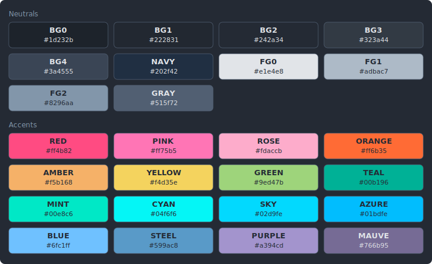
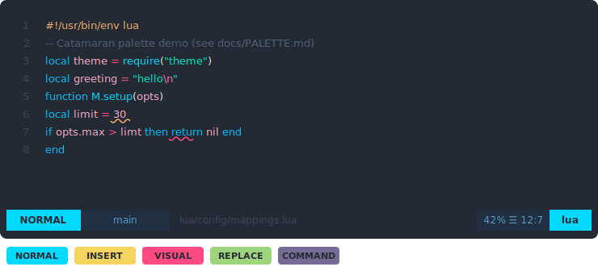
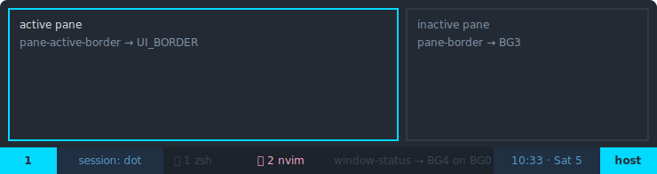
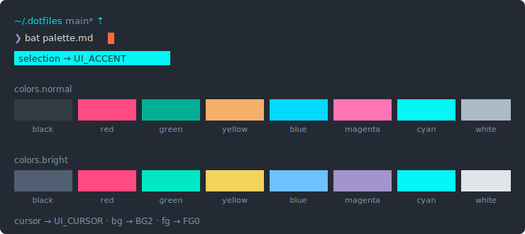

# Palette

The color palette behind the **Catamaran** theme, shared by every tool in
these dotfiles.

## How it is organised and maintained

Everything lives in one place: the palette block of `config/env/.env`, in two
layers.

- **Layer 1 — named colors (the palette).** 26 exports, and the **only place
  hex literals live**: numbered neutrals (`PALETTE_BG0`–`PALETTE_BG4`,
  `PALETTE_NAVY`, `PALETTE_FG0`–`PALETTE_FG2`, `PALETTE_GRAY`) plus 16
  accents with real color names (`PALETTE_RED`, `PALETTE_SKY`,
  `PALETTE_MINT`, …).
- **Layer 2 — roles (semantic aliases).** Shell aliases grouped by area —
  `PALETTE_CODE_*` (syntax), `PALETTE_UI_*` (cross-tool chrome),
  `PALETTE_MODE_*` (vi-mode indicators) — each pointing at a layer-1 color.
  Consumers use a role when they mean the semantic ("error text is
  `UI_ERROR` everywhere") and a base color when it is decoration (tmux
  section backgrounds, Alacritty's ANSI table).

Colors reach tools four ways:

1. **Templates at login** — `render-templates` (run from `~/.zprofile`)
   envsubsts alacritty, bat, sketchybar, borders, alfred, gh-dash, lazygit
   and process-compose configs; the `:hex` tag converts to the `0xAARRGGBB`
   form sketchybar/borders need.
2. **Live shell environment** — tmux (server environment) and fzf
   (`FZF_DEFAULT_OPTS` in `tools.zsh`).
3. **Prompt-time reads** — oh-my-posh via `{{ .Env.PALETTE_* }}`.
4. **Neovim** — `lua/palettes/catamaran.lua` reads `vim.env` with hex
   fallbacks for env-less launches.

Tools configured with ANSI indexes or names — tig, starship, p10k — inherit
the palette **transitively** through Alacritty's ANSI table and are left
untouched on purpose.

**Changing a color:** edit its one hex in layer 1, then open a fresh login
shell (or `zsh -lc render-templates`) and restart the tmux server.
**Re-mapping a semantic:** change one alias line in layer 2.
**Guardrails:** the doctor's `templates` check flags stale rendered files;
`tests/unit/palette-sync.bats` fails when the Neovim fallbacks, `.vimrc`
hexes, the tables below, or the generated mockups drift from `.env`. After a
palette edit, regenerate the mockups with `devbox run palette-assets`.

## Named colors (layer 1)

| Name | Hex | Typical use |
| --- | --- | --- |
| `PALETTE_BG0` | `#1d232b` | darkest background — tmux status section C, nvim statusline/separators |
| `PALETTE_BG1` | `#222831` | nvim color column (ruler) |
| `PALETTE_BG2` | `#242a34` | **main background** (terminal, editor, bars) |
| `PALETTE_BG3` | `#323a44` | raised background — ANSI black, cursor line, popup menus |
| `PALETTE_BG4` | `#3a4555` | lightest background — inactive borders, muted text on dark |
| `PALETTE_NAVY` | `#202f42` | blue-tinted background — statusline section B, inactive statusline, lazygit selection |
| `PALETTE_FG0` | `#e1e4e8` | primary foreground, ANSI bright white |
| `PALETTE_FG1` | `#adbac7` | secondary foreground — ANSI white |
| `PALETTE_FG2` | `#8296aa` | tertiary foreground — hints, dim text |
| `PALETTE_GRAY` | `#515f72` | muted — comments, line numbers, ANSI bright black |
| `PALETTE_RED` | `#ff4b82` | errors, operators, visual mode |
| `PALETTE_PINK` | `#ff75b5` | secondary accent, special chars |
| `PALETTE_ROSE` | `#fdaccb` | identifiers, constants, tmux active tab |
| `PALETTE_ORANGE` | `#ff6b35` | cursor |
| `PALETTE_AMBER` | `#f5b168` | warnings, preprocessor, ANSI yellow |
| `PALETTE_YELLOW` | `#f4d35e` | insert mode, alacritty hints, ANSI bright yellow |
| `PALETTE_GREEN` | `#9ed47b` | replace mode |
| `PALETTE_TEAL` | `#00b196` | success, ANSI green |
| `PALETTE_MINT` | `#00e8c6` | strings, ANSI bright green |
| `PALETTE_CYAN` | `#04f6f6` | primary accent, ANSI cyan, selection |
| `PALETTE_SKY` | `#02d9fe` | functions, borders, normal mode, ANSI blue, underlined text |
| `PALETTE_AZURE` | `#01bdfe` | keywords |
| `PALETTE_BLUE` | `#6fc1ff` | info, ANSI bright blue |
| `PALETTE_STEEL` | `#599ac8` | statusline section B foreground |
| `PALETTE_PURPLE` | `#a394cd` | focus, ANSI bright magenta |
| `PALETTE_MAUVE` | `#766b95` | command mode |

## Roles (layer 2)

### Code — syntax colors (nvim highlights, bat theme)

| Role | Color | Used for |
| --- | --- | --- |
| `PALETTE_CODE_STRING` | `PALETTE_MINT` | strings |
| `PALETTE_CODE_KEYWORD` | `PALETTE_AZURE` | keywords, statements, types |
| `PALETTE_CODE_FUNCTION` | `PALETTE_SKY` | functions, markdown headings |
| `PALETTE_CODE_IDENTIFIER` | `PALETTE_ROSE` | variables, attributes |
| `PALETTE_CODE_CONSTANT` | `PALETTE_ROSE` | numbers, language constants |
| `PALETTE_CODE_COMMENT` | `PALETTE_GRAY` | comments |
| `PALETTE_CODE_OPERATOR` | `PALETTE_RED` | operators, punctuation |
| `PALETTE_CODE_PREPROCESSOR` | `PALETTE_AMBER` | preprocessor, imports |
| `PALETTE_CODE_SPECIAL` | `PALETTE_PINK` | escapes, regexp |

### UI — cross-tool chrome (fzf, sketchybar, borders, gh-dash, lazygit, process-compose, alfred, oh-my-posh, nvim)

| Role | Color | Used for |
| --- | --- | --- |
| `PALETTE_UI_ACCENT` | `PALETTE_CYAN` | primary accent — active borders, icons, selection |
| `PALETTE_UI_ACCENT_ALT` | `PALETTE_PINK` | secondary accent — prompts, search matches |
| `PALETTE_UI_SUCCESS` | `PALETTE_TEAL` | success, diff added |
| `PALETTE_UI_WARNING` | `PALETTE_AMBER` | warnings, diff changed |
| `PALETTE_UI_ERROR` | `PALETTE_RED` | errors, diff deleted, bell |
| `PALETTE_UI_INFO` | `PALETTE_BLUE` | info |
| `PALETTE_UI_HINT` | `PALETTE_FG2` | hints, faint text |
| `PALETTE_UI_FOCUS` | `PALETTE_PURPLE` | focus, selection highlight |
| `PALETTE_UI_BORDER` | `PALETTE_SKY` | window/pane borders |
| `PALETTE_UI_CURSOR` | `PALETTE_ORANGE` | cursor |

### Mode — vi-mode indicators (lualine, alacritty `vi_mode_cursor`)

| Role | Color | Used for |
| --- | --- | --- |
| `PALETTE_MODE_NORMAL` | `PALETTE_SKY` | normal mode |
| `PALETTE_MODE_INSERT` | `PALETTE_YELLOW` | insert mode |
| `PALETTE_MODE_VISUAL` | `PALETTE_RED` | visual mode |
| `PALETTE_MODE_REPLACE` | `PALETTE_GREEN` | replace mode |
| `PALETTE_MODE_COMMAND` | `PALETTE_MAUVE` | command mode |

## The palette in context

Generated mockups (stylized, not pixel-true — they document which color lands
where). Regenerate with `devbox run palette-assets`; sources are the
`*.svg.template` files beside them.

### Neovim

### tmux

### Alacritty

## Deliberately outside the palette

- **ANSI-indexed tools** — tig (`.tigrc` color indexes), starship (named ANSI
  colors), p10k (indexes 1–7): themed transitively via Alacritty's ANSI
  table. Do not wire them to `PALETTE_*`.
- **`config/vim/.vimrc`** — hexes are hardcoded on purpose so the file stays
  a single copyable unit for servers; each hex is annotated with its palette
  name and membership is test-enforced. Its three diff backgrounds
  (`#12352f`, `#3a1c28`, `#2a3240`) are vim-only tints with no palette entry.
- **sketchybar `BAR_COLOR`** — transparent (`0x00000000`), no palette
  equivalent.
- **Vimium hint colors** — stock extension styling in browser-side JSON, not
  env-renderable.
- **Docs Mermaid diagrams** — Mermaid cannot read env vars; diagrams carry
  literal hexes with the palette name in a comment.
