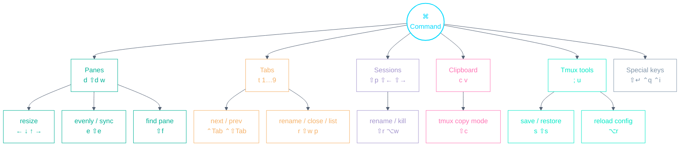

# Terminal Playbook

A cheat-sheet for the terminal emulators in this repo. Every binding below is
taken from the actual configs, with terminal defaults marked _(default)_.

All terminals launch [tmux](TMUX.md) directly at startup
(`zsh -l -i -c "tmux attach || tmux new-session"`, so a reopened terminal
reattaches to the existing session instead of spawning a new one) and bind
almost every `⌘` chord to a tmux prefix sequence. **The keybindings
are identical across every terminal here**, so the tables below apply to all.

## The terminals

| Terminal                                            | Package            |
| --------------------------------------------------- | ------------------ |
| [Alacritty](https://github.com/alacritty/alacritty) | `config/alacritty` |
| [Ghostty](https://github.com/ghostty-org/ghostty)   | `config/ghostty`   |

- **`⌘` chords are tmux commands in disguise** — the tables show the `⌃b`
  sequence each one sends.
- Shell-line editing (the zsh vi-mode) is separate — see the
  [Zsh Vi-mode Playbook](ZSH.md).

---

## Muscle-memory starter — the 8 to learn first

| Keys              | Action                                |
| ----------------- | ------------------------------------- |
| `⌘d` / `⌘⇧d`      | Vertical / horizontal pane            |
| `⌘t`              | New tab                               |
| `⌃Tab` / `⌃⇧Tab`  | Next / previous tab                   |
| `⌘` + (`1` … `9`) | Switch to a tab by number             |
| `⌘w`              | Close the current pane                |
| `⌘c` / `⌘v`       | Copy / paste via the system clipboard |
| `⌘⇧c`             | Enter tmux copy mode                  |
| `⌘⇧p`             | Pick a session                        |

---

## Keyspace at a glance

The whole `⌘` namespace, one level deep — the mental model behind the tables
below.

---

## Panes

| Keys                             | Sends        | Action                           |
| -------------------------------- | ------------ | -------------------------------- |
| `⌘d`                             | `⌃b %`       | Vertical pane (keeps the cwd)    |
| `⌘⇧d`                            | `⌃b "`       | Horizontal pane (keeps the cwd)  |
| `⌘w`                             | `⌃b x`       | Close the pane — no confirmation |
| `⌘` + (`←` \| `↓` \| `↑` \| `→`) | `⌃b H/J/K/L` | Resize the pane                  |
| `⌘e`                             | `⌃b E`       | Spread panes out evenly          |
| `⌘⇧e`                            | `⌃b ⌃s`      | Toggle pane synchronisation      |
| `⌘⇧f`                            | `⌃b f`       | Search for a pane                |

Pane _focus_ is not a `⌘` chord: use `⌃` + (`h` \| `j` \| `k` \| `l`), which
moves across tmux panes and vim splits alike (see [TMUX.md](TMUX.md)).

---

## Tabs (tmux windows)

| Keys              | Sends           | Action                    |
| ----------------- | --------------- | ------------------------- |
| `⌘t`              | `⌃b c`          | New tab (keeps the cwd)   |
| `⌃Tab` / `⌃⇧Tab`  | `⌃b n` / `⌃b p` | Next / previous tab       |
| `⌘` + (`1` … `9`) | `⌃b 1…9`        | Switch to a tab by number |
| `⌘p`              | `⌃b w`          | Choose a tab from a tree  |
| `⌘r`              | `⌃b ,`          | Rename the tab            |
| `⌘⇧w`             | `⌃b &`          | Close the tab             |

---

## Sessions

| Keys          | Sends           | Action                             |
| ------------- | --------------- | ---------------------------------- |
| `⌘⇧p`         | `⌃b s`          | Choose a session from a tree       |
| `⌘⇧←` / `⌘⇧→` | `⌃b (` / `⌃b )` | Previous / next session            |
| `⌘⇧r`         | `⌃b $`          | Rename the session                 |
| `⌘⌥w`         | `⌃b Q`          | Kill the session — no confirmation |

---

## Clipboard

| Keys             | Sends          | Action                              |
| ---------------- | -------------- | ----------------------------------- |
| `⌘c`             | `Copy` action  | Copy the selection to the clipboard |
| `⌘v` _(default)_ | `Paste` action | Paste from the clipboard            |
| `⌘⇧c`            | `⌃b [`         | Enter tmux copy mode                |

The full clipboard flow across tmux/zsh and the terminals is in
[CLIPBOARD.md](CLIPBOARD.md).

---

## Tmux tools

| Keys  | Sends   | Action                                   |
| ----- | ------- | ---------------------------------------- |
| `⌘;`  | `⌃b :`  | Open the tmux command prompt             |
| `⌘u`  | `⌃b u`  | Grab and open a URL (tmux-urlview)       |
| `⌘s`  | `⌃b S`  | Save the environment (tmux-resurrect)    |
| `⌘⇧s` | `⌃b R`  | Restore the environment (tmux-resurrect) |
| `⌘⌥r` | `⌃b ⌃r` | Reload the tmux config                   |

---

## Special keys

These bindings fix terminal key-encoding quirks rather than drive tmux:

| Keys      | Sends     | Why                                                                                                   |
| --------- | --------- | ----------------------------------------------------------------------------------------------------- |
| `⇧Return` | `⎋` + `↵` | Insert a newline without submitting (REPLs, Claude Code, etc.)                                        |
| `⌃i`      | `⌃n i`    | Lets vim tell `⌃i` apart from `Tab` (vim maps `⌃n i` back to `⌃i`)                                    |
| `⌃q` ¹    | raw `⌃q`  | macOS swallows `⌃q` by default ([alacritty#1359](https://github.com/alacritty/alacritty/issues/1359)) |

¹ Alacritty only — the swallowed-key bug is Alacritty-specific; Ghostty passes
`⌃q` through natively, so it has no such binding.

---

## Per-terminal notes

The shortcut tables above are shared. What follows is the small set of things
that genuinely differ between terminals.

### Ghostty

Ghostty mirrors the Alacritty bindings 1:1 but reaches them through its own
config syntax. Translation rules (Alacritty → Ghostty):

| Alacritty (`alacritty.toml`)     | Ghostty (`config`)               |
| -------------------------------- | -------------------------------- |
| `key = "X"`, `mods = "Command"`  | `keybind = cmd+x=…`              |
| `mods = "Command\|Shift"`        | `cmd+shift+…`                    |
| `chars = "\u0002x"` (`⌃b` + `x`) | `text:\x02x`                     |
| `key = "Left"` (arrows)          | `left` / `down` / `up` / `right` |
| `action = "Copy"`                | `copy_to_clipboard`              |

After editing, `ghostty +validate-config` checks the syntax and
`ghostty +list-keybinds` shows the result (`⌘` prints as `super`).

**Deliberate differences** — two Alacritty bindings have no Ghostty
counterpart, on purpose:

| Keys | Alacritty                                                                                | Ghostty        | Why                                              |
| ---- | ---------------------------------------------------------------------------------------- | -------------- | ------------------------------------------------ |
| `⌘c` | explicit `Copy` action                                                                   | _(no binding)_ | `copy_to_clipboard` is already a Ghostty default |
| `⌃q` | re-sends raw `⌃q` ([alacritty#1359](https://github.com/alacritty/alacritty/issues/1359)) | _(no binding)_ | the swallowed-key bug is Alacritty-specific      |

Conversely, Ghostty ships **native** splits/tabs on the same keys (`⌘d`, `⌘t`,
`⌘w`, `⌘1…9`, …). The config overrides each of these per key with the tmux
sequence so tmux stays the one multiplexer — never use `keybind = clear`, which
would also wipe the defaults worth keeping (`⌘c` `⌘v` `⌘n` `⌘q`).

**Behavior parity** — settings mirrored from the Alacritty `alacritty.toml`
(≈ marks approximations):

| Alacritty                         | Ghostty                                   |
| --------------------------------- | ----------------------------------------- |
| `[font]` family / size            | `font-family` / `font-size`               |
| `font.offset.y = 12`              | `adjust-cell-height = 12` ≈               |
| `window.dimensions` 120×26        | `window-width` / `window-height`          |
| `window.padding` 15/5             | `window-padding-x` / `window-padding-y`   |
| `decorations = "buttonless"`      | `macos-titlebar-style = hidden` ≈         |
| `selection.save_to_clipboard`     | `copy-on-select = clipboard`              |
| `cursor` blinking block           | `cursor-style` + `cursor-style-blink`     |
| `scrolling.multiplier = 3`        | `mouse-scroll-multiplier = 3`             |
| `scrolling.history = 10000` lines | default `scrollback-limit` (byte-based)   |
| `colors.toml.template`            | `colors.template` — same `PALETTE_*` vars |

**Truecolor & TERM** — Ghostty sets `TERM=xterm-ghostty`; tmux's
`terminal-overrides` in `config/tmux/.tmux.conf` includes `xterm-ghostty:RGB`
so truecolor survives. Inside tmux, `TERM` is `tmux-256color` as usual. When
ssh-ing from a bare Ghostty (outside tmux) to a host without the
`xterm-ghostty` terminfo, use `TERM=xterm-256color ssh …`.

### Colors

All terminals draw from the shared palette in `config/env/.env` via the
template flow ([ARCHITECTURE.md](ARCHITECTURE.md)): Alacritty renders
`colors.toml.template` → `colors.toml`, Ghostty renders `colors.template` →
`colors` (loaded via `config-file`). Both use the same `PALETTE_*` vars, so
edit hexes **only** in `config/env/.env`, then re-render with
`render-templates`.

---

## Keeping the terminals in sync

The bindings exist once per terminal — `alacritty.toml` (Alacritty) and
`config` (Ghostty) — with `alacritty.toml` as the source of truth.
`tests/unit/terminal-sync.bats` parses both configs and diffs the chord →
tmux-sequence maps, so drift fails CI and the diff names the offending binding
(the two deliberate differences above are whitelisted). Behavior parity and the
docs are **not** machine-checked, so those stay a manual convention: **when you
add, remove, or change a binding or behavior in one terminal, make the same
change in the other and update this doc, all in the same commit.**

---

_Source of truth: `config/alacritty/.config/alacritty/alacritty.toml`, mirrored 1:1 by
`config/ghostty/.config/ghostty/config`, enforced by
`tests/unit/terminal-sync.bats`. When you change a binding, update the other
terminal and this file in the same commit._
