# Tmux Playbook

A personal, config-accurate cheat-sheet for the terminal multiplexer. Every
keybinding below is taken from this repo's actual config —
`config/tmux/.tmux.conf` — with tmux defaults clearly marked _(default)_.
[tmux](https://github.com/tmux/tmux) runs inside Alacritty, which launches it
at startup and fronts many of these bindings with `⌘` shortcuts — see the
[Alacritty Playbook](ALACRITTY.md).

- **The prefix is `⌃b`** (tmux default). So `⌃b c` means `⌃b`, release, then `c`.
- Copy mode is **vi-style** (`mode-keys vi`).
- Windows and panes are numbered **from 1**, and renumber when one closes.
- The mouse works too: scroll, select panes, drag to copy.

---

## Muscle-memory starter — the 8 to learn first

| Keys                             | Action                                            |
| -------------------------------- | ------------------------------------------------- |
| `⌃` + (`h` \| `j` \| `k` \| `l`) | Move between panes **and** vim splits (no prefix) |
| `⌃b %` / `⌃b "`                  | Split vertically / horizontally, keeping the cwd  |
| `⌃b z`                           | Zoom the current pane in/out                      |
| `⌃b c`                           | New window in the current directory               |
| `⌃b ⌃b`                          | Toggle the last-used window                       |
| `⌃b [` then `v` … `y`            | Copy mode: select, yank to system clipboard       |
| `⌃b s`                           | Pick a session                                    |
| `⌃b ⌃r`                          | Reload the tmux config                            |

---

## Keyspace at a glance

The whole prefix (`⌃b`) namespace, one level deep — plus the few keys that
work without the prefix.

```mermaid
%%{init: {'flowchart': {'nodeSpacing': 18, 'rankSpacing': 45}}}%%
flowchart TD
    prefix(("Prefix<br/>⌃b")):::core

    prefix --> panes["Panes<br/>% #quot; h j k l"]:::panes
    panes --> panes1["resize<br/>H J K L"]:::panes
    panes --> panes2["zoom / kill<br/>z x"]:::panes
    panes --> panes3["even layout<br/>= |"]:::panes
    panes --> panes4["sync input<br/>⌃s"]:::panes

    prefix --> win["Windows<br/>c n p 1…9"]:::win
    win --> win1["last window<br/>⌃b"]:::win
    win --> win2["rename / kill<br/>, #amp;"]:::win

    prefix --> sess["Sessions<br/>s $ ( ) d"]:::sess
    sess --> sess1["kill<br/>Q"]:::sess

    prefix --> copy["Copy mode<br/>#91;"]:::copy
    copy --> copy1["select<br/>v V ⌃v"]:::copy
    copy --> copy2["yank<br/>y Y"]:::copy
    prefix --> buf["Buffers<br/>b P #93;"]:::copy

    prefix --> plug["Plugins<br/>I U"]:::plug
    plug --> plug1["save / restore<br/>S R"]:::plug
    plug --> plug2["open URLs<br/>u"]:::plug

    prefix --> cfg["Reload config<br/>⌃r"]:::cfg

    noprefix(("No<br/>prefix")):::core
    noprefix --> np1["panes ⇄ vim splits<br/>⌃h ⌃j ⌃k ⌃l"]:::panes
    noprefix --> np2["swap window<br/>⌃⇧← ⌃⇧→"]:::win

    %% Colors from config/env/.env palette (see docs/ARCHITECTURE.md):
    %% core=#02d9fe  panes=#00b196  win=#f5b168  sess=#a394cd
    %% copy=#ff75b5  plug=#00e8c6  cfg=#8296aa  links=#515f72
    classDef core fill:transparent,stroke:#02d9fe,stroke-width:2px,color:#02d9fe
    classDef panes fill:transparent,stroke:#00b196,color:#00b196
    classDef win fill:transparent,stroke:#f5b168,color:#f5b168
    classDef sess fill:transparent,stroke:#a394cd,color:#a394cd
    classDef copy fill:transparent,stroke:#ff75b5,color:#ff75b5
    classDef plug fill:transparent,stroke:#00e8c6,color:#00e8c6
    classDef cfg fill:transparent,stroke:#8296aa,color:#8296aa
    linkStyle default stroke:#515f72,color:#8296aa
```

---

## Panes

| Keys                              | Action                                                            |
| --------------------------------- | ----------------------------------------------------------------- |
| `⌃b %` / `⌃b "`                   | Split vertically / horizontally — **in the current directory**    |
| `⌃` + (`h` \| `j` \| `k` \| `l`)  | Move between panes and vim splits (vim-tmux-navigator, no prefix) |
| `⌃b` + (`h` \| `j` \| `k` \| `l`) | Focus pane left/down/up/right                                     |
| `⌃b` + (`H` \| `J` \| `K` \| `L`) | Resize pane left/down/up/right                                    |
| `⌃b =` / `⌃b \|`                  | Even horizontal / vertical layout                                 |
| `⌃b ⌃s`                           | Toggle pane synchronisation (type into all panes at once)         |
| `⌃b x`                            | Kill pane — **no confirmation**                                   |
| `⌃b z` _(default)_                | Toggle pane zoom                                                  |
| `⌃b q` _(default)_                | Show pane numbers; follow with a number to jump                   |
| `⌃b ;` / `⌃b o` _(default)_       | Last pane / next pane                                             |
| `⌃b !` _(default)_                | Break the pane out into its own window                            |
| `⌃b {` / `⌃b }` _(default)_       | Move the pane left / right                                        |
| `⌃b E` _(default)_                | Spread panes out evenly                                           |
| `⌃b f` _(default)_                | Search for a pane                                                 |

Pane borders (with the pane title) only appear when a window has more than one
pane — a hook turns them on after a split and off when one pane remains.

---

## Windows

| Keys                        | Action                                    |
| --------------------------- | ----------------------------------------- |
| `⌃b c`                      | New window — **in the current directory** |
| `⌃b ⌃b`                     | Toggle the last-used window               |
| `⌃⇧←` / `⌃⇧→`               | Swap the window left / right (no prefix)  |
| `⌃b n` / `⌃b p` _(default)_ | Next / previous window                    |
| `⌃b 1` … `9` _(default)_    | Switch to window by number                |
| `⌃b w` _(default)_          | Choose a window from a tree               |
| `⌃b ,` _(default)_          | Rename the window                         |
| `⌃b &` _(default)_          | Kill the window (asks to confirm)         |

Windows auto-rename to the basename of the current directory, so manual
renames are rarely needed.

---

## Sessions

| Keys                        | Action                                 |
| --------------------------- | -------------------------------------- |
| `⌃b s` _(default)_          | Choose a session from a tree           |
| `⌃b $` _(default)_          | Rename the session                     |
| `⌃b (` / `⌃b )` _(default)_ | Previous / next session                |
| `⌃b d` _(default)_          | Detach from the session                |
| `⌃b Q`                      | Kill the session — **no confirmation** |

`detach-on-destroy` is off: killing a session's last window switches you to
another running session instead of dropping you out of tmux.

---

## Copy mode, clipboard & buffers

Enter copy mode with `⌃b [` (or Alacritty's `⌘⇧c`). Navigation is vi-style —
`h j k l`, `w`/`b` by word, `g`/`G` top/bottom, `/`/`?` search with `n`/`N` —
all _(default)_. The full clipboard flow across tmux/zsh/Alacritty is in
[CLIPBOARD.md](CLIPBOARD.md).

**In copy mode**

| Keys                    | Action                                             |
| ----------------------- | -------------------------------------------------- |
| `v` / `V`               | Begin selection / select line                      |
| `⌃v`                    | Rectangle (block) selection                        |
| `H` / `L`               | Jump to start / end of line                        |
| `y`                     | Copy selection to the system clipboard (tmux-yank) |
| `Y`                     | Paste selection onto the command line (tmux-yank)  |
| `o` / `⌃o`              | Open selection / open it in `$EDITOR` (tmux-open)  |
| `Enter` _(default)_     | Copy selection (reaches the clipboard too)         |
| `q` / `Esc` _(default)_ | Quit copy mode / clear selection                   |

**Outside copy mode**

| Keys               | Action                                                          |
| ------------------ | --------------------------------------------------------------- |
| `⌃b y`             | Copy the shell command line to the clipboard (tmux-yank)        |
| `⌃b Y`             | Copy the current working directory to the clipboard (tmux-yank) |
| `⌃b u`             | Grab and open a URL from the window (tmux-urlview)              |
| `⌃b b`             | List paste buffers                                              |
| `⌃b P`             | Choose a buffer to paste from                                   |
| `⌃b ]` _(default)_ | Paste the most recent buffer                                    |

---

## Plugins (TPM)

Plugins are managed by [tpm](https://github.com/tmux-plugins/tpm); a
fresh-machine safety net in `.tmux.conf` installs them on first launch.

| Keys                | Action                                   |
| ------------------- | ---------------------------------------- |
| `⌃b I` _(default)_  | Install plugins                          |
| `⌃b U` _(default)_  | Update plugins                           |
| `⌃b ⌥u` _(default)_ | Uninstall plugins removed from the list  |
| `⌃b S`              | Save the environment (tmux-resurrect)    |
| `⌃b R`              | Restore the environment (tmux-resurrect) |

tmux-continuum auto-restores the last saved environment when tmux starts
(Alacritty launches tmux itself, so there's no `@continuum-boot`).
vim-tmux-navigator, tmux-yank, tmux-open and tmux-urlview provide the
navigation, clipboard, open and URL keys listed in the sections above.

---

## Config & behavior notes

| Keys               | Action                                         |
| ------------------ | ---------------------------------------------- |
| `⌃b ⌃r`            | Reload `.tmux.conf` (replaces the default `r`) |
| `⌃b :` _(default)_ | Enter command mode                             |
| `⌃b t` _(default)_ | Show a digital clock                           |
| `⌃b ?` _(default)_ | List all key bindings                          |

Quality-of-life settings worth knowing: `escape-time 0` (no delay leaving
insert mode in vim), 50k-line scrollback, status line on top, activity
monitoring that mutes itself while a pane runs `nvim`, and
`aggressive-resize` for multiple attached clients.

---

_Source of truth: `config/tmux/.tmux.conf`. When you change a binding there,
update this file in the same commit._
