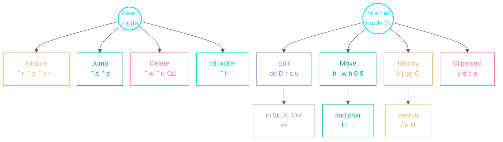

# Zsh Vi-mode Playbook

A personal, config-accurate cheat-sheet for vi-style shell-line editing. Every
keybinding below is taken from this repo's actual config —
`config/zsh/.config/zsh/bindings.zsh` — with zsh vi-mode defaults clearly
marked _(default)_. This is the shell layer: it works in any terminal, on both
macOS and Linux ([Alacritty](ALACRITTY.md) is just where you'll use it).

- **`Esc` (or `⌃[`) enters Normal mode**; `i`, `I`, `a`, or `A` return to
  Insert mode. `KEYTIMEOUT=20` means `Esc` registers in 200ms while multi-key
  commands (`dd`, `vv`) stay typable.
- Yank/delete/change and paste are **mirrored to the system clipboard**
  (see [Clipboard integration](#clipboard-integration)).

---

## Muscle-memory starter — the 8 to learn first

| Keys                 | Action                                               |
| -------------------- | ---------------------------------------------------- |
| `⌃r`                 | Fuzzy multi-word history search                      |
| `⌃f`                 | fzf directory picker under `$CODE`; cd into the pick |
| `⌃a` / `⌃e`          | Jump to start / end of line                          |
| `⌃w`                 | Delete the previous word                             |
| `⌃u`                 | Delete the whole line                                |
| `Esc` then `vv`      | Edit the command line in `$EDITOR`                   |
| `Esc` then `k` / `j` | Previous / next command in history                   |
| `Esc` then `u`       | Undo                                                 |

---

## Keyspace at a glance

Two keymaps — the `⌃` chords in Insert mode, and the vi keyspace behind `Esc`.

---

## Insert mode

| Keys        | Action                                                         |
| ----------- | -------------------------------------------------------------- |
| `⌃r`        | Fuzzy multi-word history search (history-search-multi-word)    |
| `⌃p` / `⌃n` | Previous / next history match for the typed prefix             |
| `↑` / `↓`   | Previous / next command                                        |
| `⌃f`        | fzf directory picker under `$CODE`; cd + prompt refresh (`,f`) |
| `⌃a` / `⌃e` | Jump to beginning / end of line                                |
| `⌃w`        | Delete the previous word                                       |
| `⌃u`        | Delete the whole line                                          |
| `⌫` / `⌃h`  | Delete backwards — even past where Insert mode started         |

---

## Normal mode (`Esc`, then)

**Editing**

| Keys                  | Action                                    |
| --------------------- | ----------------------------------------- |
| `vv`                  | Edit the command line in `$EDITOR`        |
| `dd` _(default)_      | Delete the whole line                     |
| `D` _(default)_       | Delete from cursor to end of line         |
| `x` / `X` _(default)_ | Delete char under / before the cursor     |
| `r` / `R` _(default)_ | Replace one char / enter replace mode     |
| `s` / `S` _(default)_ | Substitute char / whole line              |
| `u` _(default)_       | Undo                                      |
| `⌃r` _(default)_      | Redo (history search is Insert-mode `⌃r`) |

**Movement**

| Keys                                    | Action                                    |
| --------------------------------------- | ----------------------------------------- |
| `h` / `l` _(default)_                   | Left / right                              |
| `0` / `^` / `$` _(default)_             | Line start / first non-blank / line end   |
| `w` `W` / `b` `B` / `e` `E` _(default)_ | Forward / backward / end of word          |
| `f`/`F` `t`/`T` _(default)_             | Find / till character forward/backward    |
| `;` / `,` _(default)_                   | Repeat last `f/F/t/T` / repeat in reverse |

**History & search**

| Keys                   | Action                                    |
| ---------------------- | ----------------------------------------- |
| `k` / `j` _(default)_  | Previous (older) / next (newer) command   |
| `gg` / `G` _(default)_ | First / last entry in history             |
| `/` / `?` _(default)_  | Search history backward (older) / forward |
| `n` / `N` _(default)_  | Next / previous search match              |

---

## Clipboard integration

Vi operations are wired to the macOS clipboard: `y`, `Y`, `d`, `D`, `x`, `c`,
`C` copy the affected text out via `pbcopy`, and `p` / `P` paste whatever is
on the clipboard via `pbpaste` — so text moves freely between the command
line, vim, tmux and GUI apps. The full flow is in [CLIPBOARD.md](CLIPBOARD.md).

> This mirroring hardcodes `pbcopy`/`pbpaste` and is currently macOS-only
> (noted as a portability gap in [ARCHITECTURE.md](ARCHITECTURE.md)).

---

## Shell helpers behind the keys

`⌃f` is bound to the `,f` function; both it and `,o` live in
`config/zsh/.config/zsh/functions.zsh` and operate on directories up to two
levels under `$CODE`:

| Command      | Action                                                                                |
| ------------ | ------------------------------------------------------------------------------------- |
| `,f [query]` | fzf directory picker (args seed the query); cd + register in zoxide                   |
| `,o [query]` | cd to the **best** fuzzy match and open `$EDITOR` — falls back to `,f` when ambiguous |

---

_Source of truth: `config/zsh/.config/zsh/bindings.zsh` (plus `,f`/`,o` in
`functions.zsh`). When you change a binding there, update this file in the
same commit._
